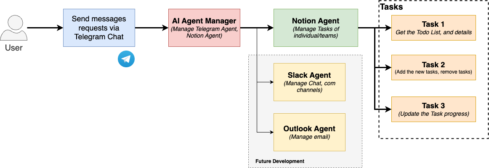

# **Controlling Telegram with AI Agent**

An advanced AI-powered assistant for Telegram that integrates with Notion to manage tasks. This project leverages  **Ollama's LLaMA models** ,  **LangGraph** , and **LangChain** to provide intelligent task management and communication through a Telegram bot.

---


[Video Demo (media/video_demo.mp4))](media/video_demo.mp4):


**Table of Contents**

1. [Project Overview](https://chatgpt.com/g/g-p-677f2961e4148191953860eeae0b7cb3-ai-agent/c/6781d6ff-8cfc-800c-a988-378740cb21d9#project-overview)
2. [Features](https://chatgpt.com/g/g-p-677f2961e4148191953860eeae0b7cb3-ai-agent/c/6781d6ff-8cfc-800c-a988-378740cb21d9#features)
3. [Technologies Used](https://chatgpt.com/g/g-p-677f2961e4148191953860eeae0b7cb3-ai-agent/c/6781d6ff-8cfc-800c-a988-378740cb21d9#technologies-used)
4. [Project Structure](https://chatgpt.com/g/g-p-677f2961e4148191953860eeae0b7cb3-ai-agent/c/6781d6ff-8cfc-800c-a988-378740cb21d9#project-structure)
5. [Setup and Installation](https://chatgpt.com/g/g-p-677f2961e4148191953860eeae0b7cb3-ai-agent/c/6781d6ff-8cfc-800c-a988-378740cb21d9#setup-and-installation)
6. [Configuration](https://chatgpt.com/g/g-p-677f2961e4148191953860eeae0b7cb3-ai-agent/c/6781d6ff-8cfc-800c-a988-378740cb21d9#configuration)
7. [How It Works](https://chatgpt.com/g/g-p-677f2961e4148191953860eeae0b7cb3-ai-agent/c/6781d6ff-8cfc-800c-a988-378740cb21d9#how-it-works)
8. [Testing](https://chatgpt.com/g/g-p-677f2961e4148191953860eeae0b7cb3-ai-agent/c/6781d6ff-8cfc-800c-a988-378740cb21d9#testing)
9. [Troubleshooting](https://chatgpt.com/g/g-p-677f2961e4148191953860eeae0b7cb3-ai-agent/c/6781d6ff-8cfc-800c-a988-378740cb21d9#troubleshooting)
10. [Future Improvements](https://chatgpt.com/g/g-p-677f2961e4148191953860eeae0b7cb3-ai-agent/c/6781d6ff-8cfc-800c-a988-378740cb21d9#future-improvements)

---

## **Project Overview**

This project creates an intelligent assistant that connects Telegram users with their Notion workspace to:

1. Add tasks to Notion.
2. Retrieve tasks from Notion based on specific criteria.
3. Provide natural language communication via a Telegram bot using a local LLaMA model powered by Ollama.

It also allows for seamless integration between Notion and Telegram, making it a handy tool for productivity enthusiasts.

---

## **Features**

* **Telegram Integration** :
* Communicate with the assistant directly via Telegram.
* Send and receive messages through a bot.
* **Notion Integration** :
* Add tasks to a Notion database.
* Query tasks from a Notion database using natural language.
* **AI-Powered Responses** :
* Use LLaMA models via Ollama for intelligent natural language understanding.
* Route requests based on intent using a Manager Agent.
* **Task Routing** :
* Automatically decide whether to handle tasks locally or forward them to Notion.

---

## **Technologies Used**

* **Programming Language** : Python 3.10
* **Machine Learning** :
* LLaMA models (via Ollama server)
* LangChain and LangGraph for agent creation
* **APIs** :
* Notion API for task management
* Telegram Bot API for messaging
* **Database** :
* SQLite for managing agent checkpoints
* **Others** :
* `dotenv` for environment variable management
* `requests` for API calls

---

## **Project Structure**

```
project/
├── agents/
│   ├── manager_agent.py         # Manages workflows and routes Telegram messages
│   ├── notion_agent.py          # Interfaces with Notion to handle tasks
│   ├── llm_integration.py       # Wrapper for the Ollama LLaMA model
├── src/
│   ├── prompts/
│   │   └── manager_agent_prompt.py # Prompt templates for manager agent
│   ├── test/
│   │   ├── test_notion_agent.py   # Tests for the Notion agent
│   ├── tools/
│   │   ├── delegate_tool.py       # Delegates tasks between agents
│   │   ├── notion.py              # Tools for Notion integration
│   ├── utils.py                   # Utility functions for Telegram communication
├── db/
│   └── checkpoints.sqlite        # SQLite database for agent checkpoints
├── main.py                       # Entry point for the application
├── .env                          # Environment variables
├── README.md                     # Project documentation
```

---

## **Setup and Installation**

### 1. **Clone the Repository**

```bash
git clone https://github.com/lamnd09/AI-Agent-Controlling-Telegram.git
cd ai-telegram-assistant
```

### 2. **Set Up a Virtual Environment**

```bash
python3 -m venv env
source env/bin/activate  # On Windows, use: env\Scripts\activate
```

### 3. **Install Dependencies**

```bash
pip install -r requirements.txt
```

### 4. **Install Ollama**

Follow the [Ollama installation guide](https://ollama.ai/) to install and set up the Ollama server.

Start the Ollama server:

```bash
ollama serve
```

Download the required model:

```bash
ollama pull llama3
```

### 5. **Set Up Telegram Bot**

* Create a bot using the Telegram BotFather.
* Obtain the  **Bot Token** .

### 6. **Set Up Notion Integration**

* Create a Notion integration and retrieve the  **Notion Token** .
* Share your database with the integration and note the  **Database ID** .

---

## **Configuration**

1. **Create a `.env` File**
   Add the following environment variables:
   ```
   TELEGRAM_TOKEN=<Your Telegram Bot Token>
   CHAT_ID=<Your Telegram Chat ID>
   NOTION_TOKEN=<Your Notion Integration Token>
   NOTION_DATABASE_ID=<Your Notion Database ID>
   OLLAMA_SERVER_URL=http://localhost:11434
   ```
2. **Verify Configuration**
   Ensure all tokens and IDs are correctly set.

---

## **How It Works**

1. **Telegram Messages** :

* Users send messages to the Telegram bot.
* `main.py` monitors messages and forwards them to the Manager Agent.

1. **Manager Agent** :

* Routes the message to the appropriate sub-agent (e.g., Notion Agent).
* If the intent is to manage tasks, invokes the Notion Agent.

1. **Notion Agent** :

* Handles task-related requests (e.g., adding or retrieving tasks).
* Communicates with Notion using its API.

1. **Ollama Integration** :

* The LLaMA model processes natural language inputs and generates responses.

1. **Response Delivery** :

* The bot sends responses back to the user via Telegram.



---

## **Testing**

### 1. **Test Telegram Integration**

Test sending and receiving messages:

```bash
python3 src/utils.py
```

### 2. **Test Notion Agent**

Run the test script for the Notion agent:

```bash
python3 src/test/test_notion_agent.py
```

### 3. **Test Manager Agent**

Test routing and task handling:

```bash
python3 src/agents/manager_agent.py
```

### 4. **Run the Full Application**

Start the bot and monitor Telegram interactions:

```bash
python3 main.py
```

---

## **Troubleshooting**

### Common Issues

1. **Telegram Bot Not Responding** :

* Verify the bot token and chat ID in `.env`.
* Check Telegram connectivity using `curl`:
  ```bash
  curl https://api.telegram.org/bot<Your Bot Token>/getUpdates
  ```

1. **Notion Integration Fails** :

* Ensure the database is shared with the integration.
* Verify `NOTION_TOKEN` and `NOTION_DATABASE_ID`.

1. **Ollama Server Not Responding** :

* Ensure the server is running:
  ```bash
  curl http://localhost:11434/
  ```
* Confirm the model is downloaded:
  ```bash
  ollama list
  ```

1. **404 Errors on `/generate`** :

* Verify the endpoint and payload structure in `OllamaLlamaWrapper`.

---

## **Future Improvements**

* Add support for more Notion features (e.g., calendar view, task updates).
* Extend Telegram bot commands for more complex workflows.
* Optimize LLaMA model prompts for better natural language understanding.
* Add Docker support for easier deployment.
* Implement user authentication for multiple Telegram users.

---

## **Contributors**

* **Your Name** - Developer
* **Your Team** - Contributors (if applicable)

---

## **License**

This project is licensed under the MIT License. See `LICENSE` for details.

---
